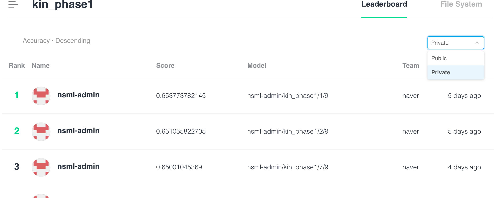

# FAQ For NSML

#### 0. phase2 update 사항
##### 1. nsml submit -t option 추가 :  테스트 모드 추가 (형식: nsml submit -t session model)
- submit시 오류가 발생할 때, 메시지를 잘 받아볼 수 없는 문제를 보완하기 위해서 -t 옵션을 추가.  
- nsml submit -t로 명령을 수행하면 테스트 셋 데이터의 첫 10줄에 대한 prediction결과를 출력합니다.
- 중간에 문제가 생기면 세션이 종료되며, 이 때 session id 가 출력되기 때문에 nsml logs를 이용해서 디버깅이 가능합니다.
- 기존 코드에 문제가 있는 경우 (각각의 경우는 FAQ 다른 항목 참고), 과거에는 세션 응답없음까지 기다렸다면, 이제는 그 전에 먼저 종료됨  
-  out of memory에러, 혹은 timeout이 발생할 경우 nsml submit -b를 이용해 배치 사이즈 조정 가능
###### 2. nsml fork
  - fork를 해서 생성한 세션에 대해서 nsml submit이 정상적으로 동작하지 않던 버그 수정


#### 0. 빠르게 submit까지 해보고 싶은데요. 핵심만 알려면 어떻게 하나요?
아래 링크를 따라하시면 빠르게 submit해보실 수 있습니다. 
https://github.com/naver/ai-hackathon-2018/blob/master/quick-guide.md

#### 1. nsml local에서 IS_DATASET import 오류가 아래와 같이 나와요.
```
Traceback (most recent call last):

  File "main.py", line 12, in <module>

    from nsml import DATASET_PATH, IS_DATASET, GPU_NUM

ImportError: cannot import name 'IS_DATASET'
```
답변)
샘플코드는 과거 버전입니다.  배포된 코드는 IS_DATASET -> HAS_DATASET으로 변경되어 배포되었습니다. 
문제 해결을 위해서 아래 링크에서 example을 새로 받으세요.
https://github.com/naver/ai-hackathon-2018/tree/master/missions/examples
​
#### 2. nsml-local를 설치 하여, local에서 작업을 하려고 하는데 아래와 같이 nsml을 인식하지 못합니다.
 (간단한 package link 문제인거 같은데...)
```
Traceback (most recent call last):
  File "main.py", line 30, in <module>
    import nsml
ModuleNotFoundError: No module named 'nsml'
```
답변) nsml local의 재설치를 위해서 아래 명령어를 실행하시면 됩니다. uninstall 및 install을 수행합니다. 
```
pip uninstall git+https://github.com/n-CLAIR/nsml-local.git;pip install git+https://github.com/n-CLAIR/nsml-local.git
```

#### 3. 영화 평점 리뷰에 대한 Tensorflow 예제는 없나요?
답변) 네에, 영화 평점 리뷰는 PyTorch로 되어있습니다. 하지만, Kin예제는 Tensorflow로 되어 있습니다. 두 예제가 비슷하므로 어렵지 않게 변경이 가능할 것으로 예상됩니다. 

#### 4. submit을 했는데, leaderboard에 변경이 없어요. 과거 submit history를 확인하는 방법이 있나요?
답변) leaderboard에 제출된 값중에서 가장 좋은 결과 1건만 보여주고 있습니다. 추가로 자신이 제출한 모든 이력을 확인하는 방법이 있습니다. 아래 그림과 같이 leaderboard에서 public 탭을 private으로 변경하시면 됩니다.



#### 5. credit은 어떻게 지급되나나요?
답변) credit은 매일 10:30(am) ~ 11:00(am) 사이에 지급됩니다. CLI의 nsml credit 명령과 web화면에서 확인 가능합니다. 

#### 6. 팀원이 두명인데, 한명만 로그인이 되어요. 정상인가요?
답변) 네에, 현재 팀원1로 등록된 분만 nsml에 접근하시어 사용가능합니다. credit 또한 1명의 계정에만 지급됩니다. 

#### 7. nsml에서 외부 python package를 설치할 수 있나요?
답변) 네에, setup.py를 통하여 추가 설치를 할 수 있습니다. 

#### 8. nsml에서 pythone이외의 lib를 사용할 방법이 있나요?
답변) 네에, 몇가지 조건을 만족하면 외부 lib를 사용할 수 있습니다. 일단, docker image를 생성하여 setup.py의 맨 위줄 #nsml: ... 형식으로 docker image의 이름을 명시하여야 합니다.
관련 내용은 아래 링크에서 참고하실 수 있습니다.  https://github.com/naver/ai-hackathon-2018/blob/master/missions/tutorial.md#%EB%AA%A8%EB%8D%B8-%EA%B5%AC%ED%98%84%ED%95%98%EA%B8%B0 

#### 9. setup.py에는 항상 #nsml로 시작해야하나요?
답변) setup.py에 첫 줄에 있는 #nsml: ... 은 nsml에서 docker Hub에 있는 외부 Docker image를 사용할 때만 적으면 됩니다. 실제로, 샘플로 제공된 kin과 movie review 예제 중에서 한쪽만 #nsml: ... 형식을 취하고 있습니다. 이곳에 아무것도 적지 않으면, nsml은 nsml사용을 위해서 생성해둔 기본 docker image를 사용하게 됩니다. 

#### 10. 학습 프로그램 작성 및 nsml 관련하여 문의는 어디로 하면 되나요? 또한 문의시 어떤 것을 적으면 될까요?
답변) 이번 해커톤 지원을 위해서 2개의 email 주소가 있습니다. 각각 용도가 따로 있으니 구분하여 문의하시는 것이 보다 빠른 회신을 받으실 수 있습니다. 
pytorch 및 NLP 관련 문의는 dl_ai_hackathon_2018_mentors@navercorp.com 로 진행하시면 되며, nsml의 실행에 관련된 문의 및 오류는 dl_ai_hackathon_2018@navercorp.com 로 문의하시면 됩니다. 문의시 자신의 session이름이 포한된 terminal상의 오류 화면을 포함하시면 됩니다.

#### 11. 다음과 같이 submit 오류가 납니다. 어떻게 해야하나요?
```
..............Error: Session does not respond
2018/04/07 08:58:12 nsml: Internal server error
```
다양한 이유로 발생할 수 있습니다. 먼저 아래에 서술된 사례를 먼저 검토해보시고, 문제가 지속된다면 정확환 원인 분석을 위해서 dl_ai_hackathon_2018@navercorp.com 로 문의 메일을 주시기 바랍니다. 보내실 때는 session이름을 확인 할 수 있도록 터미널 화면을 복사해서 보내주시면 됩니다.
알려 사례는 다음과 같습니다. 
- nsml submit시 학습데이터 셋을 참조하려고하는 경우: train과 submit는 서로 다른 환경에서 동작하고 있습니다. submit에서는 train에서 사용하는 file을 사용할 이유가 없기 때문에 해당 파일을 올려두지 않고 있습니다. 그런데, 사용자 작성 코드에서 submit시 call하게 되는 infer함수 내부에서 train용 학습셋을 참조한 경우가 있었으며 위와 같은 오류가 보고된 사례가 있었습니다. 대응 가이드로,  if config.mode == 'train': 과 같이 분기조건만 학습셋을 참조하도록 의견드렸습니다. 

#### 12. nsml run에서 구동할 수 있는 코드는 제약이 있나요?
답변) nsml run시 별도 설정이 없을 경우 main.py를 기본적으로 전송하게 됩니다. 현재는 python코드만 전송 및 수행이 가능하도록 제한을 두고 있습니다. 또한 파일명 또한 .으로 시작하면 upload할 수 없도록 막혀있습니다. 


