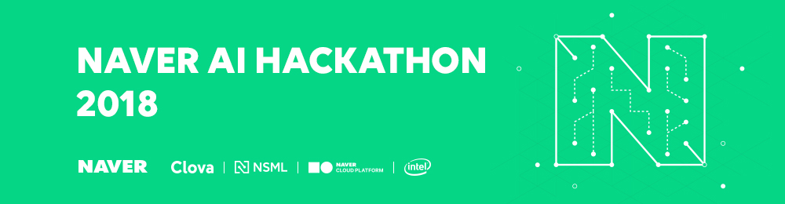
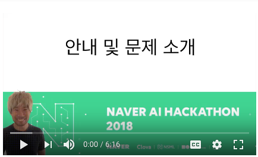
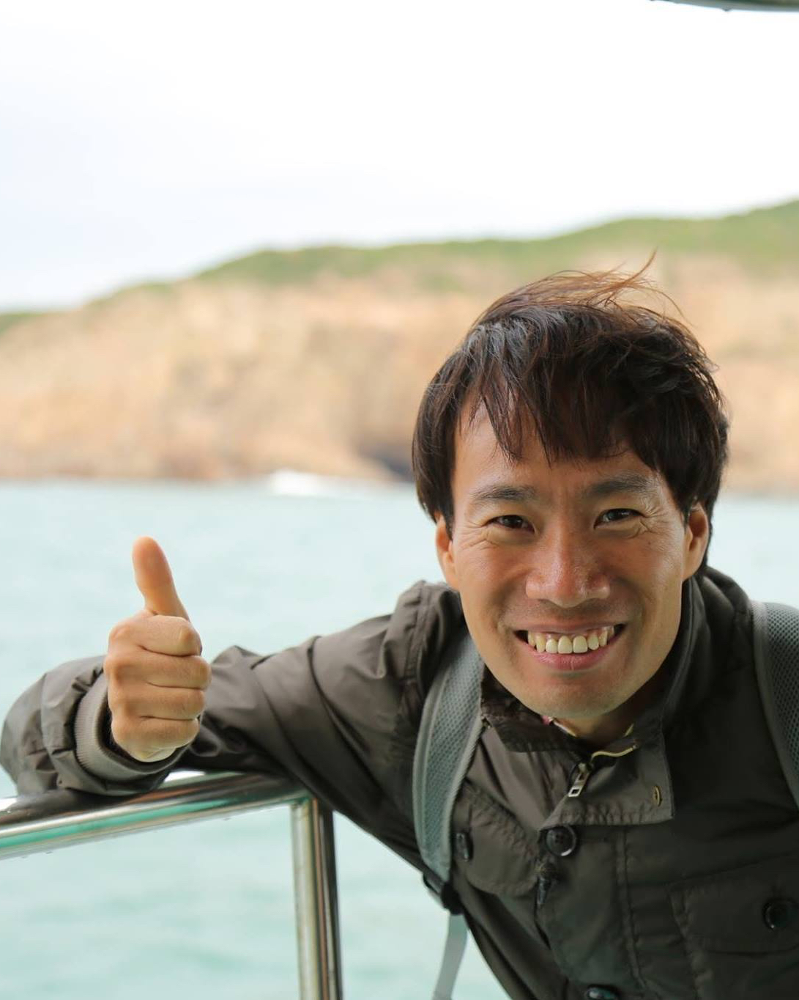
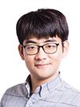
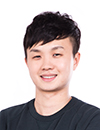
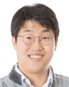
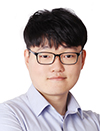

# 공지사항
### 참가 신청 마감
예상보다 많은 팀이 참가 신청 해주셨습니다. 감사합니다. 
예선 진출팀은 3월 30일(금)까지 개별 메일로 안내할 예정입니다.

# 네이버 AI 해커톤 2018

"한계를 넘어 상상에 도전하자!"

인간이 오감을 활용하는 것처럼 AI도 인간의 오감을 모두 활용하는 방향으로 나아갈 것입니다. 
또한, 인터넷과 모바일이 세상을 크게 변화시킨 것처럼 AI 역시 세상을 크게 변화시킬 것이며 그 영향력은 더욱 커질 것입니다. 
네이버는 AI와 함께 더 편리하고 행복한 미래를 만들기 위해 **네이버 AI 해커톤 2018**을 준비했습니다. 

특히, 이번 네이버 AI 해커톤 2018은 네이버의 클라우드 머신러닝 플랫폼인 <strong>[NSML](https://hack.nsml.navercorp.com/intro)</strong>과 함께 합니다.

<strong>NSML(Naver Smart Machine Learning)</strong>은 모델을 연구하고 개발하는 데 필요한 복잡한 과정을 대신 처리해주어 
연구 개발자들이 "모델 개발"에만 전념할 수 있고, 다양한 시도를 쉽게 할 수 있는 창의적인 환경을 제공할 것입니다.

AI를 통해 복잡한 문제를 해결하고 싶나요? 
AI 전문가들과 함께 문제 해결 방법을 고민하고 경험을 공유하고 싶다고요?

지금 바로 <strong>네이버 AI 해커톤 2018</strong>에 참여해서 
서로의 경험을 공유하고, 다양하고 창의적인 방법으로 문제를 해결해 보세요!

## 멘토
여러분들과 함께 문제 해결 방법을 고민하고 조언 해주실 슈퍼 멘토를 소개합니다.

<table>
  <tr style="background-color:#fff">
    <td style="text-align:center">
       
      김성훈
    </td>
    <td style="text-align:center">
       
      곽동현
    </td>
    <td style="text-align:center">
       
      서민준
    </td>
    <td style="text-align:center">
       
      송현제
    </td>
    <td style="text-align:center">
       
      최경호
    </td>
  </tr>
</table>

## 참가 신청
AI로 문제를 해결하는 데 관심 있는 분이라면 누구나 참가 신청할 수 있습니다. 
<strong>개인 또는 팀(최대 3명)</strong>으로 참가 가능합니다. [네이버 폼](http://naver.me/GyfLHzwg)으로 참가 신청하세요!

* **신청기간**: 2018년 3월 12일(월)~3월 25일(일)
* **참가 신청 폼**: http://naver.me/GyfLHzwg
* 신청자가 많을 경우 심사 후 개별 안내

## 일정
<table class="tbl_schedule">
  <tr>
    <th style="text-align:left;width:50%">일정</th>
    <th style="text-align:center;width:15%">기간</th>
    <th style="text-align:left;width:35%">장소</th>
  </tr>
  <tr>
    <td>
      <strong>참가 신청</strong> 
      2018년 3월 12일(월)~3월 25일(일)
    </td>
    <td style="text-align:center">2주</td>
    <td>
      온라인 
      <a href="http://naver.me/GyfLHzwg">http://naver.me/GyfLHzwg</a>
    </td>
  </tr>
  <tr>
    <td>
      <strong>예선</strong> 
      2018년 4월 2일(월)~4월 15일(일)
    </td>
    <td style="text-align:center">2주</td>
    <td>
      온라인 
      <a href="https://hack.nsml.navercorp.com">https://hack.nsml.navercorp.com</a>
    </td>
  </tr>
  <tr>
    <td>
      <strong>결선</strong> 
      2018년 4월 26일(목)~4월 27일(금)
    </td>
    <td style="text-align:center">1박 2일</td>
    <td>
      네이버 커넥트원(춘천) 
    </td>
  </tr>
</table>

> ※ 예선 및 결선 참가자에게는 개별로 참가 안내드립니다. 
> &nbsp;&nbsp;&nbsp;결선 참가자는 네이버 본사(그린팩토리, 분당)에 모여서 커넥트원(춘천)으로 함께 이동하며 
&nbsp;&nbsp;&nbsp;네이버 본사 - 커넥트원 간 이동 차량 및 결선 기간 중 숙식, 간식 등을 제공합니다.

## 미션
* 네이버 지식iN 질문 유사도 예측
* 네이버 영화 평점 예측

> ※ 미션 상세 설명과 NSML 튜토리얼 등은 예선 시작일인 4월 2일(월) 오전에 공개합니다.

## 진행 방식 및 심사 기준

### 예선

* 예선 참가자에게는 예선 기간 중 매일 오전 11시에 600 NSML 크레딧을 지급합니다.
* 팀 참가자일 경우 대표 팀원에게만 지급합니다.
* 사용하지 않는 크레딧은 누적됩니다.

#### ***예선 1라운드***
* 2018년 4월 2일(월) ~ 2018년 4월 8일(일)
* NSML 리더보드 순위로 2라운드 진출자 선정. 순위가 낮으면 자동 컷오프.

#### ***예선 2라운드***
* 2018년 4월 9일(월) ~ 2018년 4월 15일(일)
* NSML 리더보드 순위로 결선 진출자 선정

### 결선
* 2018년 4월 26일(목) ~ 4월 27일(금) 1박 2일 동안 진행
* 결선 참가자에게는 600 + α NSML 크레딧을 지급합니다.
* NSML 리더보드 순위로 최종 순위를 결정합니다.

> ※ 1 NSML 크레딧으로 NSML GPU를 1분 사용할 수 있습니다. 
> &nbsp;&nbsp;&nbsp;10 NSML 크레딧 = GPU 1개 * 10분 = GPU 2개 * 5분 사용  
> ※ 예선, 결선 진출자는 개별 안내 드립니다.

## 시상 및 혜택

* 총 1000만 원 상당의 상금(각 미션별 시상) 및 기념품
* 총 1억 원 상당의 [네이버 클라우드 플랫폼 크레딧](FAQ.md#q-%EB%84%A4%EC%9D%B4%EB%B2%84-%ED%81%B4%EB%9D%BC%EC%9A%B0%EB%93%9C-%ED%94%8C%EB%9E%AB%ED%8F%BC-%ED%81%AC%EB%A0%88%EB%94%A7%EC%9D%80-%EB%AD%94%EA%B0%80%EC%9A%94) 지급
* 결선 진출자에게는 티셔츠 등의 기념품 증정
* 우수 참가자 중 네이버 인턴 지원 시 서류 전형 면제

## FAQ
자주 문의하는 내용을 확인해 보세요! [FAQ.md](FAQ.md)

## 문의
해커톤 관련 문의는 아래 이메일을 통해 할 수 있습니다. 
dl_ai_hackathon_2018@navercorp.com
